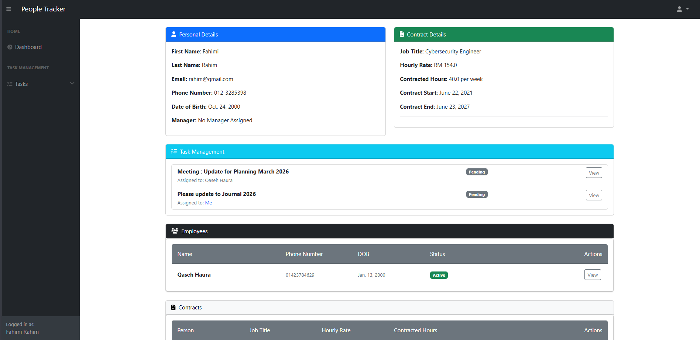

🔹 Project Overview

Team Tracker is a web-based system developed to support secure and structured management of organizational data, including user roles, task assignments, and audit-related activities. The system is designed with a strong focus on access control, accountability, and maintainability, making it suitable for environments that require controlled permissions and traceable actions.

This project was developed as part of an academic secure software design assignment and follows good version control and documentation practices.

🔹 Repository Structure

The repository is organized into logical directories to separate application logic, security components, templates, and static resources. This structure improves readability, maintainability, and security management.

team_tracker/
dashboard/
people_management/
task_management/
security/
templates/
static/
assets/
.env.example
requirements.txt
README.md

🔹 Version Control Practices

GitHub is used to manage all changes made to the project throughout development. Each update is recorded through commits with descriptive messages, allowing clear tracking of progress and responsibility. This approach supports transparency, debugging, and accountability during the software development lifecycle.

🔹 Security & Configuration Notes

Sensitive information such as secret keys and credentials is excluded from the repository.
Environment variables are documented using an .env.example file for reference.
Access permissions within the system follow role-based access control (RBAC) principles.
Repository access is restricted to authorized contributors only.

🔹 Setup Instructions (Summary)

Clone the repository
Create and activate a virtual environment
Install required dependencies
Configure environment variables using .env.example
Run database migrations
Start the development server

## Wireframes

<h3>Login Page</h3>

  

<h3>Dashboard View</h3>

  

